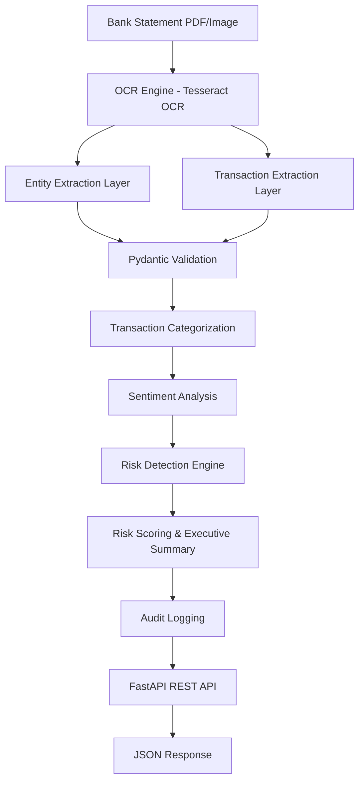

# BankDocAI - Enterprise Banking Document Intelligence Platform

## Overview

BankDocAI is an AI-powered banking document processing platform that automates OCR extraction, transaction intelligence, risk assessment, sentiment analysis, and compliance validation from bank statements. The system leverages advanced NLP and ML techniques to provide comprehensive financial document intelligence with real-time risk detection.

## Features

* OCR-based PDF and image processing
* Automated customer and transaction extraction
* Pydantic-powered data validation
* Transaction categorization engine
* Sentiment analysis module
* Risk scoring and anomaly detection
* Audit logging and workflow tracking
* FastAPI REST API deployment
* Real-time document intelligence pipeline

## Technology Stack

* Python
* FastAPI
* Pydantic
* Tesseract OCR
* PDF2Image
* Pandas
* Uvicorn
* Regular Expressions
* REST APIs

## System Workflow

1. Document Upload
2. OCR Text Extraction
3. Entity & Transaction Parsing
4. Data Validation
5. Transaction Categorization
6. Sentiment Analysis
7. Risk Detection
8. Risk Scoring
9. Audit Logging
10. API Response Generation

## Architecture Diagram



## Sample Output

### OCR Extraction & Transaction Intelligence

Processing bank statement using the real OCR engine and successfully extracting text from PDF documents:

```
Processing bank statement using the real OCR engine...
Successfully extracted text from /content/BANK_STATEMENT_2.pdf.

--- Extracted Header Entities ---
account_number: 81198100000007
ifsc: BARB0VJMDNG
bank_name: World Bank of Baroda
customer_name: CH JANAKI RAGHU RAMI REDDY MADHAVANAGAR KURNOOL
pan: None
mobile: None
email: None
statement_period: 01-12-2024 to 31-01-2025

--- Extracted Transactions ---
Transaction 1: {'date': '03-12-2024', 'description': 'Opening Balance', 'transaction_type': 'UNKNOWN', 'amount': 0.0, 'balance': 8.35}
Transaction 2: {'date': '05-12-2024', 'description': 'JPN A TOSOTOSTSSIA ASS D/EHSSOTSHEB8S 1DP4', 'transaction_type': 'CREDIT', 'amount': 1200.0, 'balance': 1200.35}
Transaction 3: {'date': '05-12-2024', 'description': 'UR SERA UA SERIA', 'transaction_type': 'DEBIT', 'amount': 150.0, 'balance': 950.35}
Transaction 4: {'date': '10-12-2024', 'description': '(Puat1181281.44/19*30:05/1Pubharatpe. 200093587', 'transaction_type': 'DEBIT', 'amount': 10.0, 'balance': 19.92}
Transaction 5: {'date': '08-01-2025', 'description': 'AS LE AEDT', 'transaction_type': 'DEBIT', 'amount': 19.0, 'balance': 0.29}
```

### Additional Sample Outputs

#### 1. Categorized Transactions with Refined Rules


This screenshot demonstrates the transaction categorization engine that classifies banking transactions into predefined categories (Miscellaneous, Transfer, etc.) based on transaction descriptions and refined rule-based logic.

#### 2. Direct Workflow Execution Results


Shows the direct workflow execution output with complete risk assessment summary including customer information, risk flags count, risk scores, and recommended actions for further review.

#### 3. Downstream Server Ingestion Results - Full Workflow


Displays the complete REST API response from the downstream server showing successful document processing with HTTP 200 OK status and comprehensive risk analysis output in JSON format.

#### 4. Complete Risk Assessment Summary


Final output demonstrating the complete risk assessment pipeline with detailed risk summary, executive summary, risk flag counts, and audit trail information for compliance and monitoring purposes.

## Business Applications

* Banking Automation
* Financial Document Intelligence
* KYC Verification
* Fraud Detection Support
* Compliance Monitoring
* Risk Assessment

## Future Enhancements

* LLM-powered Document Understanding
* RAG-based Financial Assistant
* Multi-bank Support
* Machine Learning Fraud Detection
* Dashboard & Analytics Portal
* Cloud Deployment using Docker & Kubernetes
