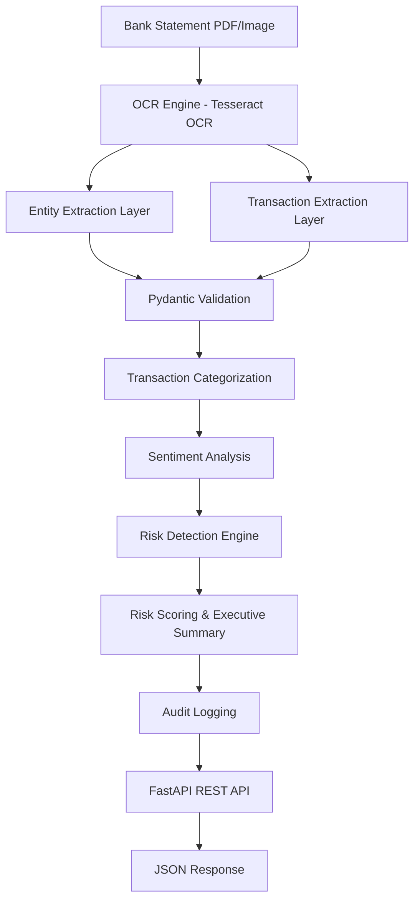

# BankDocAI - Enterprise Banking Document Intelligence Platform

## Overview

BankDocAI is an AI-powered banking document processing platform that automates OCR extraction, transaction intelligence, risk assessment, sentiment analysis, and compliance validation from bank statements. The system transforms unstructured financial documents into structured, actionable insights through an enterprise-grade workflow.

## Features

* OCR-based PDF and image processing
* Automated customer and transaction extraction
* Pydantic-powered data validation
* Transaction categorization engine
* Sentiment analysis module
* Risk scoring and anomaly detection
* Audit logging and workflow tracking
* FastAPI REST API deployment
* Real-time document intelligence pipeline

## Technology Stack

* Python
* FastAPI
* Pydantic
* Tesseract OCR
* PDF2Image
* Pandas
* Uvicorn
* Regular Expressions
* REST APIs

## System Workflow

1. Document Upload
2. OCR Text Extraction
3. Entity & Transaction Parsing
4. Data Validation
5. Transaction Categorization
6. Sentiment Analysis
7. Risk Detection
8. Risk Scoring
9. Audit Logging
10. API Response Generation

## Architecture Diagram

## Sample Output

* Customer Information Extraction
* Transaction Intelligence
* Risk Flags
* Risk Score Calculation
* Executive Summary
* Audit Trail

## Business Applications

* Banking Automation
* Financial Document Intelligence
* KYC Verification
* Fraud Detection Support
* Compliance Monitoring
* Risk Assessment

## Future Enhancements

* LLM-powered Document Understanding
* RAG-based Financial Assistant
* Multi-bank Support
* Machine Learning Fraud Detection
* Dashboard & Analytics Portal
* Cloud Deployment using Docker & Kubernetes

